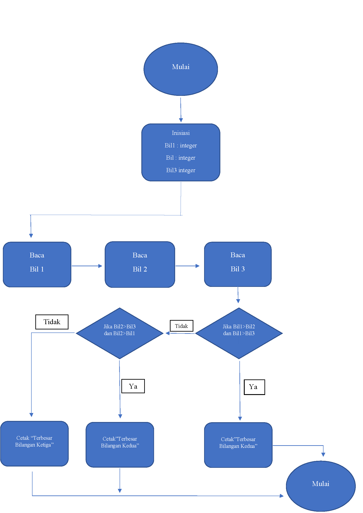
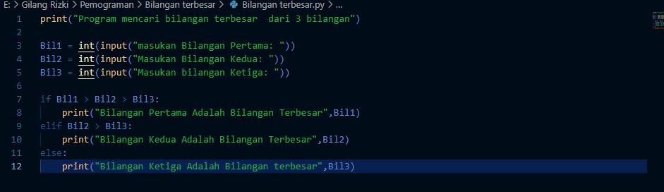
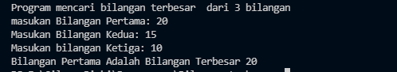
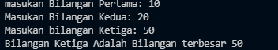

# Labspy02

# ini flowchart untuk menghitung bilangan terbesar 

# ini listing programnya 

# ini Hasil bilangan pertama yang terbesar

# ini hasil bilangan kedua yang terbesar

# ini hasil bilangan ketiga yang terbesar
